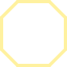
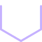

<!DOCTYPE html>
<html lang="en">
<head>
    <meta charset="UTF-8">
    <meta name="viewport" content="width=device-width, initial-scale=1.0">
    <title>Artifact Bank</title>
    
</head>
<body>
    <h1>Artifact Bank</h1>
    

    <table>
        <tr>
            <th colspan="4" class="username-header">ausgeflippt</th>
        </tr>
    
        <tr>
            <th colspan="4">🏷️ Selling</th>
        </tr>
        <tr>
            <th>Amount</th>
            <th>Artifact</th>
            <th>RS Level</th>
            <th>%</th>
        </tr>
        
                <tr>
                    <td>0</td>
                    <td></td>
                    <td>RS10</td>
                    <td>210%</td>
                </tr>
            
                <tr>
                    <td>0</td>
                    <td></td>
                    <td>RS9</td>
                    <td>210%</td>
                </tr>
            
                <tr>
                    <td>0</td>
                    <td></td>
                    <td>RS10</td>
                    <td>210%</td>
                </tr>
            
                <tr>
                    <td>0</td>
                    <td></td>
                    <td>RS9</td>
                    <td>210%</td>
                </tr>
            
        <tr>
            <th colspan="4">💰 Buying</th>
        </tr>
        <tr>
            <th>Amount</th>
            <th>Artifact</th>
            <th>RS Level</th>
            <th>%</th>
        </tr>
        
                <tr>
                    <td>0</td>
                    <td></td>
                    <td>RS7</td>
                    <td>190%</td>
                </tr>
            
        <tr>
            <td colspan="4">Guild: <a href="https://discord.com/channels/682479756104564775">The Clubs</a></td>
        </tr>
    </table>
    <table>
        <tr>
            <th colspan="4" class="username-header">benewe1337</th>
        </tr>
    
        <tr>
            <th colspan="4">🏷️ Selling</th>
        </tr>
        <tr>
            <th>Amount</th>
            <th>Artifact</th>
            <th>RS Level</th>
            <th>%</th>
        </tr>
        
                <tr>
                    <td>0</td>
                    <td></td>
                    <td>RS6</td>
                    <td>270%</td>
                </tr>
            
        <tr>
            <th colspan="4">💰 Buying</th>
        </tr>
        <tr>
            <th>Amount</th>
            <th>Artifact</th>
            <th>RS Level</th>
            <th>%</th>
        </tr>
        
                <tr>
                    <td>0</td>
                    <td></td>
                    <td>RS6</td>
                    <td>270%</td>
                </tr>
            
                <tr>
                    <td>0</td>
                    <td></td>
                    <td>RS6</td>
                    <td>270%</td>
                </tr>
            
        <tr>
            <td colspan="4">Guild: <a href="https://discord.com/channels/503756389705973760">\[c̲̲̅σ̲̲̅и̲̲̅т̲̲̅i̲̲̅и̲̲̅υ̲̅υм\]</a></td>
        </tr>
    </table>
    <table>
        <tr>
            <th colspan="4" class="username-header">caprican</th>
        </tr>
    
        <tr>
            <th colspan="4">🏷️ Selling</th>
        </tr>
        <tr>
            <th>Amount</th>
            <th>Artifact</th>
            <th>RS Level</th>
            <th>%</th>
        </tr>
        
                <tr>
                    <td>0</td>
                    <td></td>
                    <td>RS11</td>
                    <td>224%</td>
                </tr>
            
                <tr>
                    <td>0</td>
                    <td></td>
                    <td>RS11</td>
                    <td>224%</td>
                </tr>
            
                <tr>
                    <td>2</td>
                    <td></td>
                    <td>RS11</td>
                    <td>224%</td>
                </tr>
            
                <tr>
                    <td>0</td>
                    <td></td>
                    <td>RS11</td>
                    <td>224%</td>
                </tr>
            
        <tr>
            <th colspan="4">💰 Buying</th>
        </tr>
        <tr>
            <th>Amount</th>
            <th>Artifact</th>
            <th>RS Level</th>
            <th>%</th>
        </tr>
        
                <tr>
                    <td>0</td>
                    <td></td>
                    <td>RS11</td>
                    <td>224%</td>
                </tr>
            
                <tr>
                    <td>0</td>
                    <td></td>
                    <td>RS11</td>
                    <td>100%</td>
                </tr>
            
        <tr>
            <td colspan="4">Guild: <a href="https://discord.com/channels/355101373483712513">The Star League</a></td>
        </tr>
    </table>
    <table>
        <tr>
            <th colspan="4" class="username-header">cmaster.</th>
        </tr>
    
        <tr>
            <th colspan="4">💰 Buying</th>
        </tr>
        <tr>
            <th>Amount</th>
            <th>Artifact</th>
            <th>RS Level</th>
            <th>%</th>
        </tr>
        
                <tr>
                    <td>0</td>
                    <td></td>
                    <td>RS12</td>
                    <td>500%</td>
                </tr>
            
        <tr>
            <td colspan="4">Guild: <a href="https://discord.com/channels/355101373483712513">The Star League</a></td>
        </tr>
    </table>
    <table>
        <tr>
            <th colspan="4" class="username-header">drmineword</th>
        </tr>
    
        <tr>
            <th colspan="4">🏷️ Selling</th>
        </tr>
        <tr>
            <th>Amount</th>
            <th>Artifact</th>
            <th>RS Level</th>
            <th>%</th>
        </tr>
        
                <tr>
                    <td>0</td>
                    <td></td>
                    <td>RS1</td>
                    <td>500%</td>
                </tr>
            
        <tr>
            <th colspan="4">💰 Buying</th>
        </tr>
        <tr>
            <th>Amount</th>
            <th>Artifact</th>
            <th>RS Level</th>
            <th>%</th>
        </tr>
        
                <tr>
                    <td>0</td>
                    <td></td>
                    <td>RS1</td>
                    <td>0%</td>
                </tr>
            
                <tr>
                    <td>0</td>
                    <td></td>
                    <td>RS1</td>
                    <td>500%</td>
                </tr>
            
        <tr>
            <td colspan="4">Guild: <a href="https://discord.com/channels/1235485927951044638">Black Star llc</a></td>
        </tr>
    </table>
    <table>
        <tr>
            <th colspan="4" class="username-header">dungeonmaster7755</th>
        </tr>
    
        <tr>
            <th colspan="4">💰 Buying</th>
        </tr>
        <tr>
            <th>Amount</th>
            <th>Artifact</th>
            <th>RS Level</th>
            <th>%</th>
        </tr>
        
                <tr>
                    <td>0</td>
                    <td></td>
                    <td>RS9</td>
                    <td>270%</td>
                </tr>
            
        <tr>
            <td colspan="4">Guild: <a href="https://discord.com/channels/355101373483712513">The Star League</a></td>
        </tr>
    </table>
    <table>
        <tr>
            <th colspan="4" class="username-header">huogewoci.</th>
        </tr>
    
        <tr>
            <th colspan="4">🏷️ Selling</th>
        </tr>
        <tr>
            <th>Amount</th>
            <th>Artifact</th>
            <th>RS Level</th>
            <th>%</th>
        </tr>
        
                <tr>
                    <td>0</td>
                    <td></td>
                    <td>RS10</td>
                    <td>278%</td>
                </tr>
            
        <tr>
            <td colspan="4">Guild: <a href="https://discord.com/channels/503756389705973760">\[c̲̲̅σ̲̲̅и̲̲̅т̲̲̅i̲̲̅и̲̲̅υ̲̅υм\]</a></td>
        </tr>
    </table>
    <table>
        <tr>
            <th colspan="4" class="username-header">myrdnnwyltt</th>
        </tr>
    
        <tr>
            <th colspan="4">🏷️ Selling</th>
        </tr>
        <tr>
            <th>Amount</th>
            <th>Artifact</th>
            <th>RS Level</th>
            <th>%</th>
        </tr>
        
                <tr>
                    <td>0</td>
                    <td></td>
                    <td>RS9</td>
                    <td>190%</td>
                </tr>
            
        <tr>
            <th colspan="4">💰 Buying</th>
        </tr>
        <tr>
            <th>Amount</th>
            <th>Artifact</th>
            <th>RS Level</th>
            <th>%</th>
        </tr>
        
                <tr>
                    <td>0</td>
                    <td></td>
                    <td>RS9</td>
                    <td>190%</td>
                </tr>
            
        <tr>
            <td colspan="4">Guild: <a href="https://discord.com/channels/503756389705973760">\[c̲̲̅σ̲̲̅и̲̲̅т̲̲̅i̲̲̅и̲̲̅υ̲̅υм\]</a></td>
        </tr>
    </table>
    <table>
        <tr>
            <th colspan="4" class="username-header">pagy1234</th>
        </tr>
    
        <tr>
            <th colspan="4">💰 Buying</th>
        </tr>
        <tr>
            <th>Amount</th>
            <th>Artifact</th>
            <th>RS Level</th>
            <th>%</th>
        </tr>
        
                <tr>
                    <td>0</td>
                    <td></td>
                    <td>RS7</td>
                    <td>198%</td>
                </tr>
            
                <tr>
                    <td>0</td>
                    <td></td>
                    <td>RS7</td>
                    <td>198%</td>
                </tr>
            
        <tr>
            <td colspan="4">Guild: <a href="https://discord.com/channels/503756389705973760">\[c̲̲̅σ̲̲̅и̲̲̅т̲̲̅i̲̲̅и̲̲̅υ̲̅υм\]</a></td>
        </tr>
    </table>
    <table>
        <tr>
            <th colspan="4" class="username-header">toxic.masculinity</th>
        </tr>
    
        <tr>
            <th colspan="4">💰 Buying</th>
        </tr>
        <tr>
            <th>Amount</th>
            <th>Artifact</th>
            <th>RS Level</th>
            <th>%</th>
        </tr>
        
                <tr>
                    <td>0</td>
                    <td></td>
                    <td>RS9</td>
                    <td>270%</td>
                </tr>
            
                <tr>
                    <td>0</td>
                    <td></td>
                    <td>RS9</td>
                    <td>240%</td>
                </tr>
            
                <tr>
                    <td>0</td>
                    <td></td>
                    <td>RS9</td>
                    <td>240%</td>
                </tr>
            
        <tr>
            <td colspan="4">Guild: <a href="https://discord.com/channels/503756389705973760">\[c̲̲̅σ̲̲̅и̲̲̅т̲̲̅i̲̲̅и̲̲̅υ̲̅υм\]</a></td>
        </tr>
    </table>
    <table>
        <tr>
            <th colspan="4" class="username-header">willie6999</th>
        </tr>
    
        <tr>
            <th colspan="4">🏷️ Selling</th>
        </tr>
        <tr>
            <th>Amount</th>
            <th>Artifact</th>
            <th>RS Level</th>
            <th>%</th>
        </tr>
        
                <tr>
                    <td>0</td>
                    <td></td>
                    <td>RS11</td>
                    <td>274%</td>
                </tr>
            
                <tr>
                    <td>0</td>
                    <td></td>
                    <td>RS11</td>
                    <td>274%</td>
                </tr>
            
                <tr>
                    <td>0</td>
                    <td></td>
                    <td>RS10</td>
                    <td>274%</td>
                </tr>
            
                <tr>
                    <td>0</td>
                    <td></td>
                    <td>RS11</td>
                    <td>274%</td>
                </tr>
            
        <tr>
            <th colspan="4">💰 Buying</th>
        </tr>
        <tr>
            <th>Amount</th>
            <th>Artifact</th>
            <th>RS Level</th>
            <th>%</th>
        </tr>
        
                <tr>
                    <td>0</td>
                    <td></td>
                    <td>RS9</td>
                    <td>274%</td>
                </tr>
            
        <tr>
            <td colspan="4">Guild: <a href="https://discord.com/channels/503756389705973760">\[c̲̲̅σ̲̲̅и̲̲̅т̲̲̅i̲̲̅и̲̲̅υ̲̅υм\]</a></td>
        </tr>
    </table>
    

</body>
</html>
